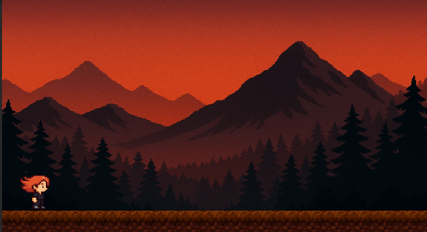
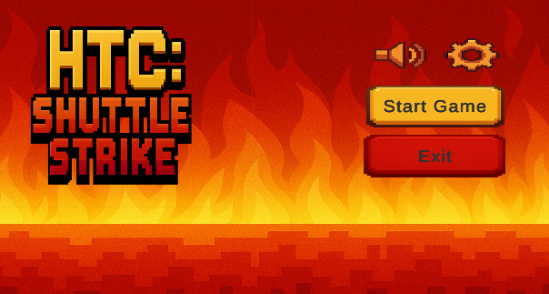

# 🏸 HTC-Shuttle Strike

**HTC Shuttle Strike** is a personal 2D platformer game project where I combined **AI-generated pixel art** with manual edits to bring unique characters to life.  
In this project, I transformed my girlfriend into a **pixel-art game character** using **ChatGPT (AI image generation)** and **Paint** to create various poses and animations.

---

## 🎯 Project Goal

The aim of this project is to create a **simple yet fun platform game** where the player controls a character through different levels, avoiding obstacles and interacting with the environment. The game mechanics are designed to be straightforward, focusing on character movement and gameplay flow.

---

## 🎨 Character Creation

- **Base Design:** AI-generated pixel art
- **Pose Editing:** Manual refinement in Paint to adjust body positions
- **Animations:** Created for various states like idle, run, jump, fire, hurt, strike, and pose

---

## 🛠️ Technologies Used

- **Engine:** Unity 2D
- **Programming Language:** C#
- **Art:** Combination of AI generation and manual pixel editing

---

## 📸 In-Game Screenshots

---

## 🚀 Current Status

The project is in the early development phase. The main focus is currently on:
- Character animations
- Basic movement controls
- Platform level design

---

## 📌 Future Plans

- Implement collectibles and scoring system
- Add enemies and basic combat mechanics
- Create multiple levels with increasing difficulty

---

## 👤 Developer

**Mustafa Tunç**  
GitHub: [@tuncmstf](https://github.com/tuncmstf)

